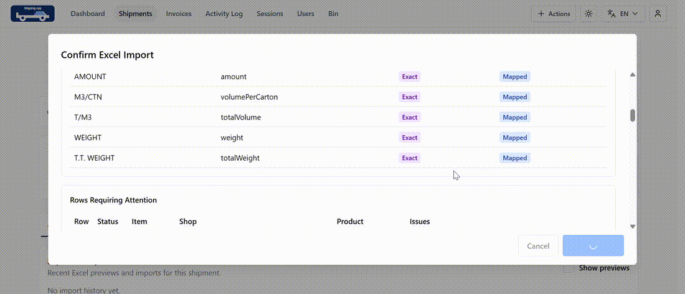
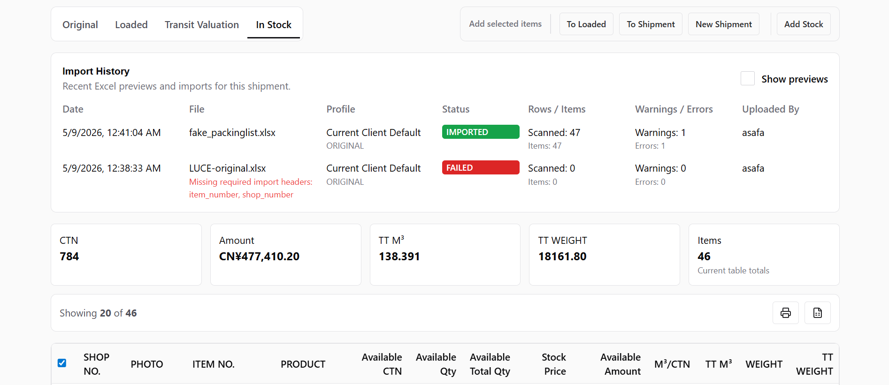
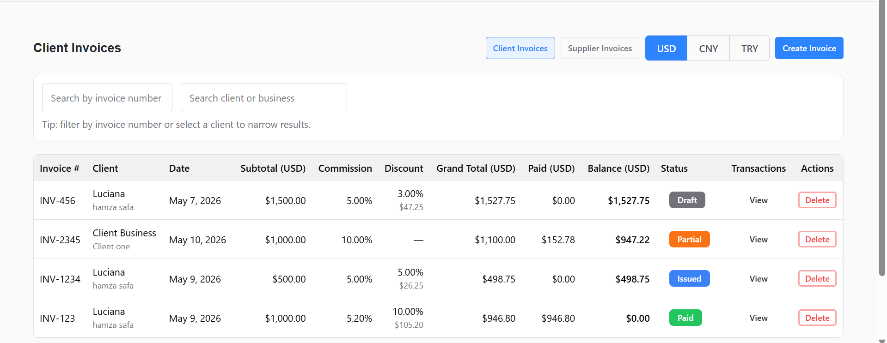
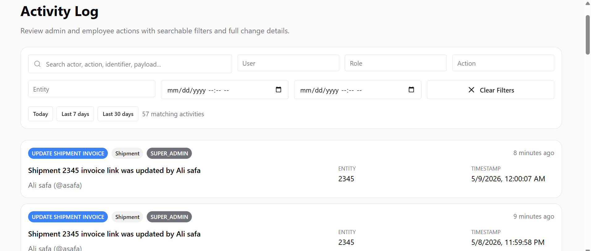
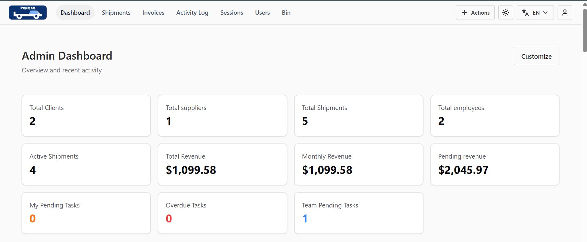
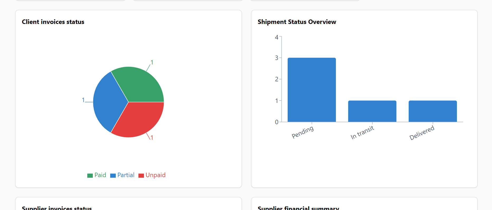
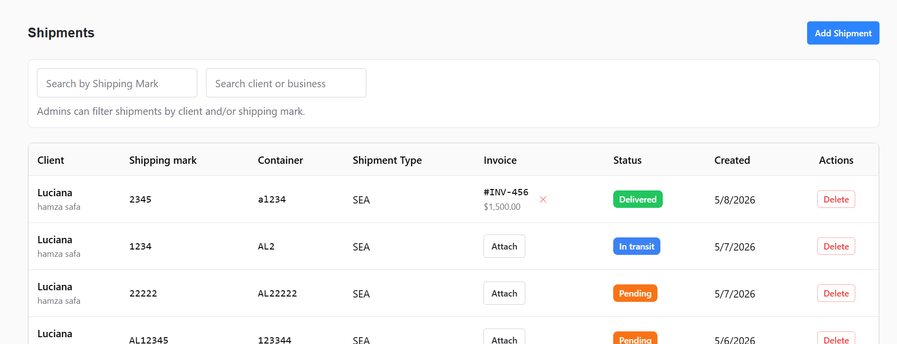
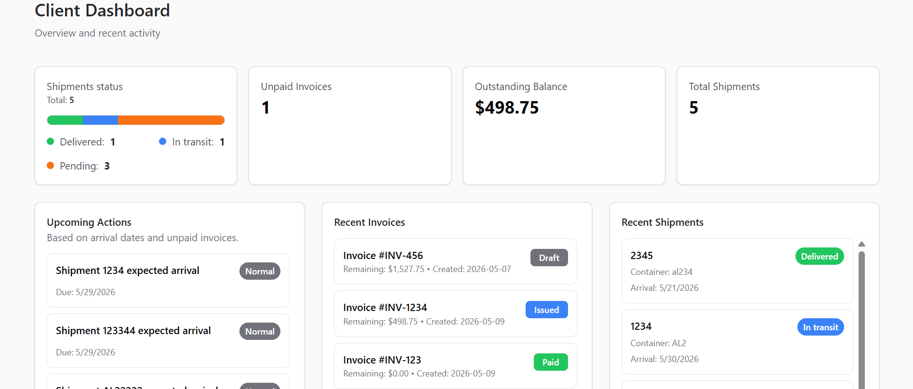
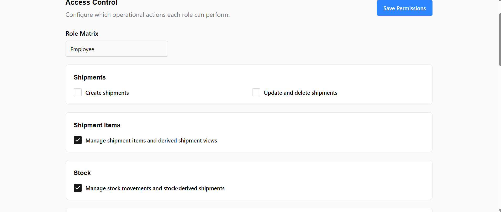

# Shipping Ops Platform

A self-hosted shipping company operations platform for shipment tracking, stock workflows, invoicing, payments, role-based access control, and spreadsheet-based imports.

Built for shipping and operations teams that rely on Excel-heavy workflows but need stronger process control, financial visibility, and internal governance.

---

## Demo

[Watch full demo](./assets/demo.mp4)

---

## Highlights

- Shipment lifecycle tracking
- Loaded, transit, and in-stock item views
- Configurable Excel import workflow
- Client and supplier invoice management
- Multi-currency financial calculations
- Payments and refunds
- Role-aware dashboards
- Persistent access-control matrix
- Audit log and activity tracking
- Client portal

---

## Screenshots

### Stock, Transit & Import Workflow

Shipment items are tracked across original, loaded, transit, and in-stock operational states, with Excel imports, validation history, and stock movement workflows.

---

### Invoice Management

Client and supplier invoice workflows with multi-currency totals, payment state, refund handling, and linked shipment data.

---

### Activity Log

Audit trail for operational and administrative actions across shipments, invoices, users, access control, and authentication events.

---

### Admin Dashboard

Operational overview with shipment metrics, financial summaries, task visibility, charts, and recent activity.

---

### Dashboard Analytics

Role-aware dashboard widgets for monitoring shipment states, invoice status, revenue, and operational activity.

---

### Shipment Management

Shipment list with lifecycle statuses, invoice linkage, filtering, and operational actions.

---

### Client Portal

Client-facing dashboard for shipment visibility, invoice tracking, outstanding balances, and recent activity.

---

### Access Control

Database-backed permission matrix that allows the super admin to configure what admins and employees can access.

---

## Product Scope

The app combines shipping operations, stock handling, invoicing, payments, refunds, tasks, audit logs, company settings, exchange rates, users, sessions, and access control into one internal platform.

It is designed for companies that still depend on spreadsheets, WhatsApp, and manual coordination, but need a centralized system for daily operations.

---

## What Makes It Different From Basic CRUD

The app models real shipping-company workflows instead of treating everything as simple records.

- Original shipment items are separate from loaded items.
- Transit valuation is separate from original shipment data.
- Stock can be derived from leftover shipment quantities or entered manually.
- Stock can be allocated into existing shipments or moved into loaded items.
- Excel imports are previewed, validated, and reviewed before being applied.
- Invoice totals are calculated from payments, refunds, exchange rates, discounts, and commissions.
- User capabilities are controlled through a configurable permission matrix.

---

## Roles & Access Control

The system supports four roles:

- `SUPER_ADMIN`
- `ADMIN`
- `EMPLOYEE`
- `CLIENT`

The super admin can configure role capabilities through a persistent permission matrix. This allows one company to give employees broader operational control while another company can restrict them to specific workflows such as stock handling, imports, or shipment updates.

Client access is intentionally constrained and focused on shipment and invoice visibility.

---

## Tech Stack

### Backend

- Kotlin
- Ktor
- PostgreSQL
- Exposed ORM
- Flyway migrations
- Apache POI for Excel parsing
- Koin dependency injection
- JWT authentication with refresh token rotation

### Frontend

- React 19
- TypeScript
- Vite
- Chakra UI
- TanStack Query
- React Router
- i18next
- dnd-kit
- Recharts
- Axios

---

## Architecture Notes

The backend is organized around controllers, services, repositories, models, and configuration modules.

The frontend is organized around route pages, domain components, API services, query hooks, shared layout, theming, and localization utilities.

The project is built as a production-oriented internal operations system rather than a demo CRUD dashboard.

---

## Status

This repository is a showcase repository for a private shipping operations application.
